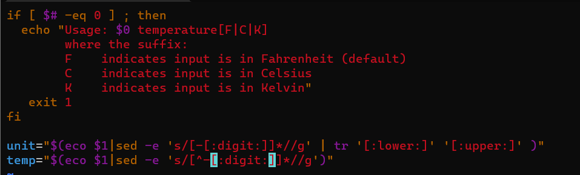

# Exam_2420
Part 1:

The apt update command will update the package lists to reflect the latest available versions of the software in the repositories. The apt upgrade command will then upgrade all of the installed packages to their latest versions.<pre><code>sudo apt update && sudo apt upgrade</pre></code>

Part 2:

I used <pre><code>h,j,m,k,gj,gk</pre></code>
to move around. I used <pre><code>a</pre></code>to append the 1 to 0 and V to C
<pre><code>cw</pre></code>
to change the word numbs to digit

Part 3:
<pre><code>journalctl -b -p warning -o json-pretty</pre></code>
I used
<pre><code>/-b</pre></code>
inside the man page to find boot option

Then I used
<pre><code>/-p</pre></code>
to find priority and then found the warning arugment

Finally I searched 
<pre><code>/pretty</pre></code>

and found output field command

Part 4:

File Path: /etc/systemd/system/find_users.sh
<pre><code>#!/bin/bash

# Output the currently logged-in user to the /etc/motd file
echo "Currently logged in user: $(whoami)" > /etc/motd

# Loop through all users with a UID between 1000 and 5000
for user in $(awk -F: '$3 >= 1000 && $3 <= 5000 {print $1}' /etc/passwd); do
  # Get the user's UID and shell
  uid=$(id -u $user)
  shell=$(grep "^$user:" /etc/passwd | cut -d: -f7)

  # Output the user's information to the /etc/motd file
  echo "User: $user, UID: $uid, Shell: $shell" >> /etc/motd
done

</pre></code>

Part 5:
File Path: /etc/systemd/system/find_users.service
<pre><code>
[Unit]
Description=User Info Service

[Service]
Type=simple
ExecStart=/etc/systemd/system/find_users.sh

[Install]
WantedBy=multi-user.target
</pre></code>

Part 6:
Timer Unit file
File Path: /etc/systemd/system/find_users.timer
<pre><code>
[Unit]
Description=User Info Timer

[Timer]
OnBootSec=1min
OnUnitActiveSec=1day

[Install]
WantedBy=timers.target
</pre></code>

